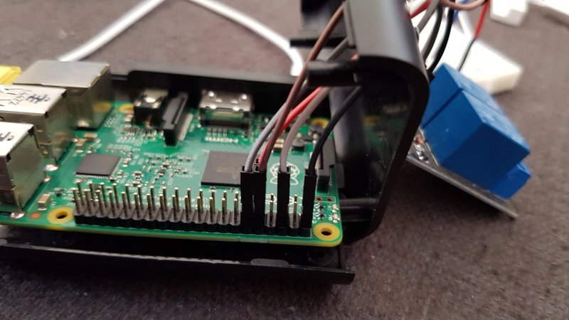
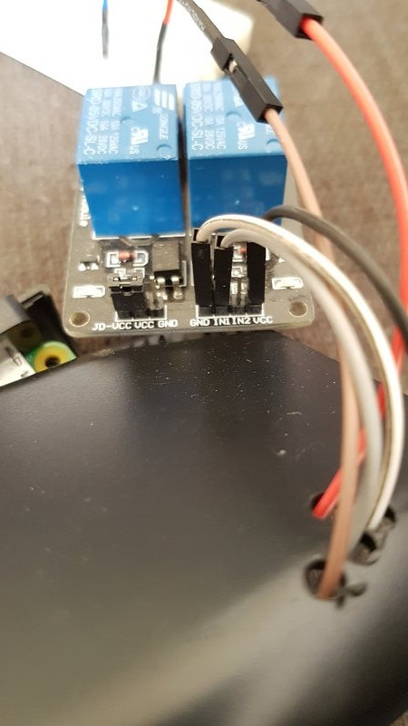
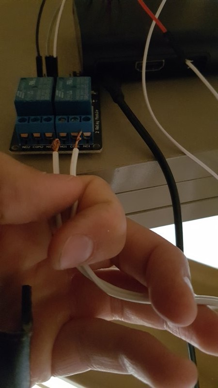
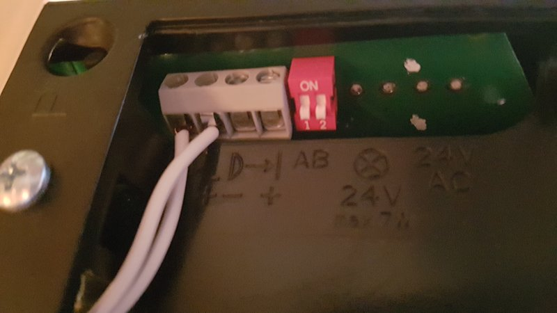
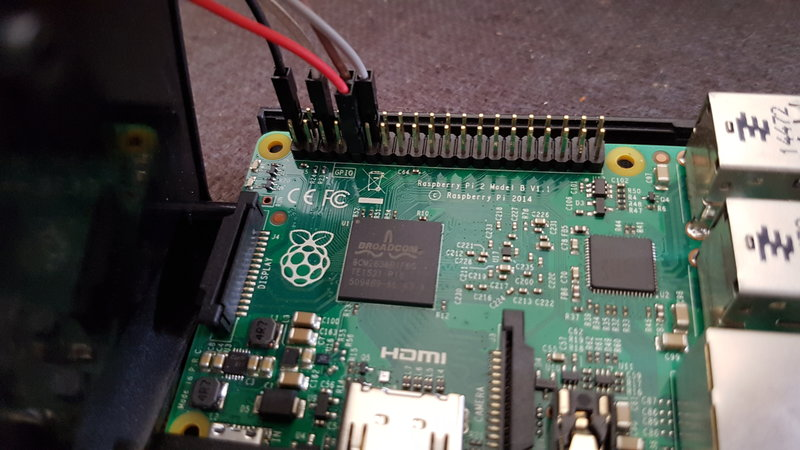
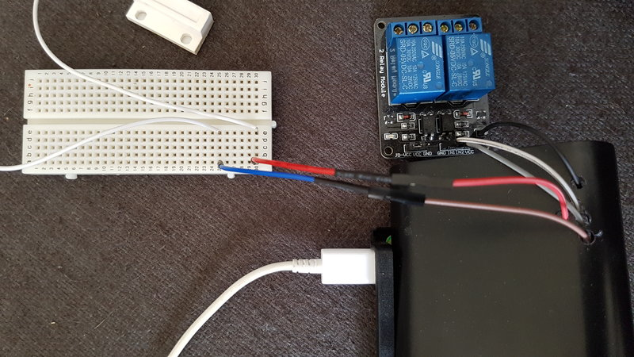

# gogo-garage-opener
Go implementation of a Raspberry Pi garage door opener

#### Features

* Open garage door using a [mobile app](#apps)
* Generate one time pins to allow someone temporary access to your garage i.e. A delivery man or a friend or a family member.

#### Apps
[Garage Opener on Play Store](https://play.google.com/store/apps/details?id=uk.echosoft.garageopener&hl=en_GB) ([source](https://github.com/benjefferies/gogo-garage-opener-android))

Garage Opener for iPhone, Android App implemented using ionics framework ([source](https://github.com/benjefferies/gogo-garage-opener-ui))

#### Guide
##### Prerequisites

* Garage door opener I have an [EcoStar Liftronic 500](https://www.amazon.co.uk/gp/product/B00520C7M2/ref=oh_aui_detailpage_o03_s00?ie=UTF8&psc=1) but any model which will allow you to hook up a switch will work
* Raspberry Pi (I am using model B) wired up to internet or local network
* [Relay switch](https://www.amazon.co.uk/gp/product/B00J4FTWO2/ref=oh_aui_detailpage_o00_s00?ie=UTF8&psc=1)
* Normal open [Magnetic switch](https://www.amazon.co.uk/gp/product/B0056K5ZC2/ref=oh_aui_detailpage_o00_s00?ie=UTF8&psc=1)
* Small [solderless breadboard](https://www.amazon.co.uk/gp/product/B0040Z4QGA/ref=oh_aui_detailpage_o09_s00?ie=UTF8&psc=1)
* Clone the repository
* [Docker](https://docs.docker.com/engine/installation/) installed

##### To build

###### <a name="software">Software</a>
The build framework uses docker to make the process easier. With some fiddling about you can build it natively on the Raspberry Pi or on your developer machine.

**Note.** If compiling manually rather than using docker you will need to install an arm gcc on your developer machine compile the source. The docker build takes care of all of this.

**Building using docker**

1. Open up your command line tool and navigate to the project
1. Compile the project by running`docker build . --tag gogo-garage-opener-builder && docker run --rm -v "$PWD":/go/src/gogo-garage-opener -w /go/src/gogo-garage-opener gogo-garage-opener-builder:latest` (tested on linux)
1. You should have a binary file called `gogo-garage-opener` in the project directory
1. Copy the binary file `gogo-garage-opener` to your Raspberry Pi

##### Creating a user

To use [gogo-garage-opener-ui](https://github.com/benjefferies/gogo-garage-opener-ui) or use the APIs you will need to create an account

1. Ensure you have [built the binary](#software)
1. Run the app with `--email` and `--password` arguments e.g. `./gogo-garage-opener --email benjefferies@example.com --password secret`
1. The application will exit with a message `Created account email:benjefferies@example.com. Exiting...`

##### Running

1. Ensure you have completed the [Hardware set up](#hardware)
1. Run the application as root `sudo nohup ./gogo-garage-opener -s 15 -r 18 &`
    * nohup will redirect the output from the application to a log file called nohup.out
    * The -s argument tells the application which gpio pin the magnetic switch is hooked up to
    * The -r argument tells the application which gpio pin the relay is hooked up to
    
**Note.** If you are considering making the application available over the internet you will want your credentials to be encrypted over SSL, this can be achieved with a reverse proxy such as ngnix or apache2 with the correct mod.

##### Use one time pin

To use a one time pin go to http://localhost:8080/user/one-time-pin/abcd1234. The pin at the end is the generated pin, once the open button has been pressed the pin will be marked as used.

##### Open garage door notification
The application can be configured to notify users which have accounts via their email address if the garage door has been left open for a configurable period.
The command line argument `-notification=15m` configures the app to notify all users if the door has been left open longer than the configuration duration.
It uses [AWS SES](https://aws.amazon.com/documentation/ses/) as an SMTP service for sending the emails.
To configure the application to use your SES account you will need to set the environmental variables $AWS_ACCESS_KEY_ID, $AWS_SECRET_KEY and $AWS_SES_ENDPOINT environmental variables. See [go-ses](https://github.com/sourcegraph/go-ses#running-tests)

###### Hardware

I will describe how to set up your Raspberry Pi and the peripherals referring to the GPIO pins set up my Raspberry PI. Check that they are the same for your version.

Wiring up the relay

1. Connect up a (black) GPIO wire to pin 2 which is a 5v output
1. Connect up a (white) GPIO wire to pin 6 which is a ground
1. Connect up a (grey) GPIO wire to pin 18 which is a GPIO pin. This will be used in "out" mode to toggle the relay
1. Connect up the (black) 5v output GPIO pin 2 wire to the VCC on the relay
1. Connect up the (white) ground GPIO pin 6 wire to the GND on the relay
1. Connect up the (grey) GPIO pin 18 wire to IN1 on the relay
1. Connect the positive from the garage door to the NO1 connector on the relay
1. Connect the negative from the garage to the COM1 connector on the relay

It should now look like the images below

Wiring up the magnetic switch

1. Fix the magnet to the garage door
1. Fix the sensor to the garage door frame
1. Connect up a (brown) GPIO wire to pin 15 which is a GPIO pin. This will be used in "in" mode to read from the sensor
1. Connect up a (red) GPIO wire to pin 9 which a ground
1. Connect up the (red) ground GPIO pin 9 wire to a terminal strip on the breadboard
1. Connect up the (brown/blue) GPIO pin 15 wire to a different terminal strip on the breadboard
1. Connect one wire of the magnetic switch to the terminal strip for GPIO pin 9 and the other to the terminal strip for GPIO pin 15

#### Future

* Open garage door via location i.e. Automatically open garage within 100 metres of your garage. I have found a nice way to do this using [Automate](http://llamalab.com/automate/). I can upload a template of a flow if anyone would find it useful.
